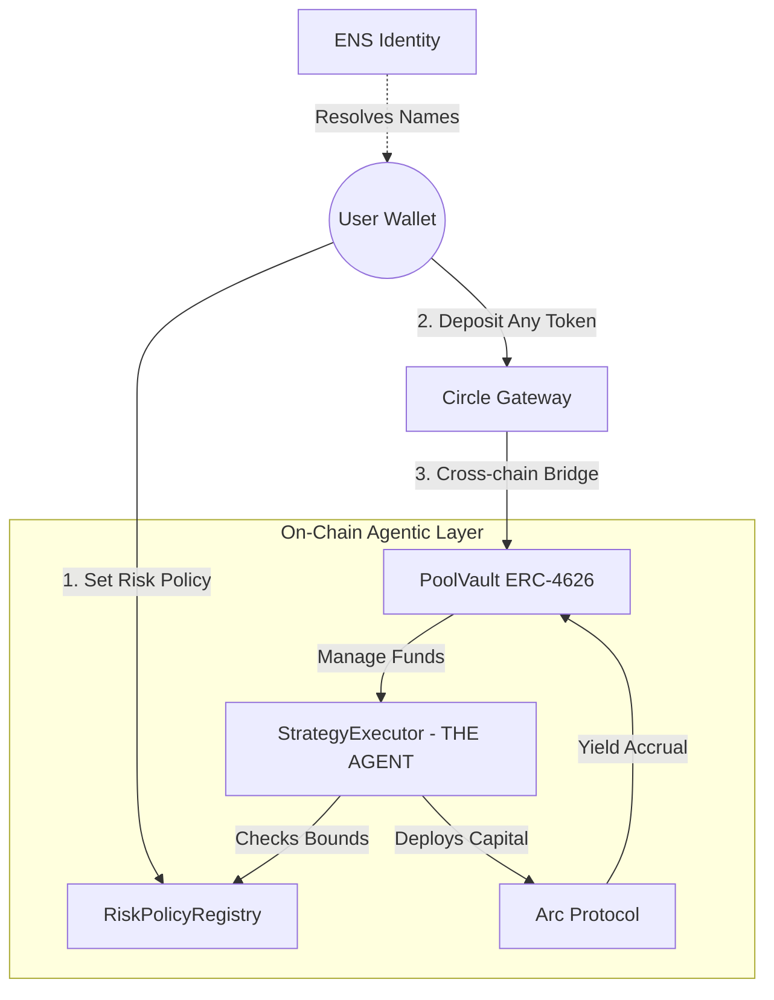

# HI.FI - Non-Custodial Agentic Treasury 🎯

### Trust the Bounds. Automate the Yield.

**HI.FI** is a decentralized treasury pooling platform that bridges the gap between AI-driven strategy and DeFi execution. By separating advice from execution, HI.FI allows users to define risk parameters once and let a deterministic on-chain agent manage capital within those strict bounds. It leverages **Arc Protocol** for yield infrastructure and **Circle's cross-chain USDC gateway** to provide a seamless, chain-abstracted experience.

> 🤖 **"The agent can execute. But only YOU define the bounds."**

---

## 🚀 Live Links

- **GitHub Repository:** [Craig-Rosario/HI.FI](https://github.com/Craig-Rosario/HI.FI)
- **Network:** Base Sepolia & Ethereum Sepolia

---

## 🧩 Partner Integrations

HI.FI integrates with **Arc (Circle)** and **ENS** to create a transparent, agentic treasury ecosystem.

### 🔵 **Arc (Circle) Integrations**

| Track | What the Track Looks For | How HI.FI Satisfies |
|-------|--------------------------|---------------------|
| **Best Chain-Abstracted USDC App** | Applications treating multiple chains as one liquidity surface using Arc and USDC. | HI.FI uses Arc as a liquidity coordination layer. Users deposit USDC from Ethereum, Base, or Arbitrum while Arc handles routing, settlement, and treasury execution behind the scenes. |
| **Build Global Payouts & Treasury Systems** | Automated treasury systems with multi-user deposits, withdrawals, and payouts. | HI.FI functions as a pooled USDC treasury with deterministic execution, automated allocation, and transparent withdrawal logic. |
| **Best Agentic Commerce App** | Autonomous agents executing USDC-denominated logic. | HI.FI implements a deterministic on-chain agent that executes user-approved treasury strategies using USDC, enforcing risk policies at the contract level. |

---

### 🟣 **ENS Integrations**

| Track | What the Track Looks For | How HI.FI Satisfies |
|-------|--------------------------|---------------------|
| **Integrate ENS** | Functional ENS resolution beyond wallet UI libraries. | HI.FI resolves ENS names on login and displays human-readable identities across dashboards, transaction history, and pool participation. |
| **Most Creative Use of ENS in DeFi** | ENS used as a meaningful protocol-level primitive. | HI.FI uses ENS as an identity layer for treasury participation, allowing pooled finance activity to be attributed to human identities instead of raw addresses. |

---

### ⭐ **ETHGlobal HackMoney Finalist Track**

| Criteria | Description | How HI.FI Satisfies |
|----------|-------------|---------------------|
| **HackMoney Finalist (Top 10)** | Functional MVP, live demo, and strong technical architecture. | HI.FI delivers a live, non-custodial, cross-chain USDC treasury with deterministic on-chain execution and a clear end-to-end user experience. |

---

## 🚀 Key Features

| Feature | Description | On-Chain/Off-Chain |
|---------|-------------|-------------------|
| **Non-Custodial Pooling** | Users maintain ownership via ERC-4626 inspired share mechanics; the vault owns the assets. | On-Chain |
| **Deterministic Agent** | The `StrategyExecutor` acts as an agent, making decisions based on pre-set risk policies (Low/Med/High). | On-Chain |
| **Chain Abstraction** | Users deposit any token from any chain; Circle Gateway handles the conversion to USDC automatically. | On-Chain |
| **Gasless UX** | Integrated with Circle Programmable Wallets (SCA) to provide gasless transactions for users. | On-Chain |
| **Scheduled Exits** | Prevents "bank runs" by using controlled withdrawal windows and batch processing. | On-Chain |

---

## 🛠️ Technology Stack

| Component | Technology | Description |
|-----------|-----------|-------------|
| **Frontend** | Next.js 15, TypeScript, TailwindCSS | User dashboard and risk profiling UI. |
| **Smart Contracts** | Solidity 0.8.28, Hardhat | Core logic for the agent, vault, and risk registry. |
| **Cross-Chain** | Circle Gateway | Handles seamless bridging and cross-chain deposits. |
| **Yield Infrastructure** | Arc Protocol | Primary layer for yield generation and arcUSDC. |
| **Identity Layer** | ENS | Human-readable attribution for pool participation. |
| **Authentication** | MetaMask | Signature-based authentication (No passwords). |

---

## 🏗️ Smart Contract Architecture

The core functionality is managed by modular Solidity contracts that separate user policy from capital deployment.

| Contract | Purpose | Key Roles |
|----------|---------|-----------|
| `PoolVault.sol` | Base treasury contract handling deposits, shares, and pool lifecycle. | Owner, User |
| `StrategyExecutor.sol` | **THE AGENT** — Executes allocations based on deterministic policy-based logic. | Agent |
| `RiskPolicyRegistry.sol` | Stores user-defined risk levels (Low, Medium, High) that cap the agent's actions. | User |
| `ArcUSDC.sol` | Wrapped yield-bearing token used for primary yield accrual within the vault. | Protocol |

### Risk → Allocation Logic

| Risk Level | Agent Behavior | Description |
|------------|----------------|-------------|
| **LOW** | 100% Vault-only strategies | Agent execution is explicitly disabled. |
| **MEDIUM** | Balanced exposure | Agent can allocate a capped percentage to stable yield pools. |
| **HIGH** | Aggressive optimization | Higher caps for the agent to move funds within Arc strategies. |

---

## 🏗️ Architecture Diagram



---

## 🧑‍💻 Getting Started (Development)

The project is structured into multiple directories: `contracts/`, `hifi/`, and `gateway/`.

### 1. Smart Contracts Setup (`contracts/`)

1. **Install Dependencies**:
   ```bash
   cd contracts
   npm install
   ```

2. **Configure**: Set up your `.env` file with your RPC URLs and private keys for Base Sepolia and Ethereum Sepolia.

3. **Compile Contracts**:
   ```bash
   npx hardhat compile
   ```

4. **Deploy Contracts**:
   ```bash
   npx hardhat run scripts/deploy-v2-pools.js --network baseSepolia
   ```

### 2. Frontend Setup (`hifi/`)

1. **Install Dependencies**:
   ```bash
   cd hifi
   npm install
   ```

2. **Configure**: Create a `.env.local` file with the following:
   ```env
   NEXT_PUBLIC_WALLET_CONNECT_PROJECT_ID=your_project_id
   MONGODB_URI=your_mongodb_uri
   CIRCLE_API_KEY=your_circle_api_key
   ```

3. **Run Development Server**:
   ```bash
   npm run dev
   ```

4. **Open**: Navigate to [http://localhost:3000](http://localhost:3000)

### 3. Gateway Setup (`gateway/unified-balance-quickstart/`)

1. **Install Dependencies**:
   ```bash
   cd gateway/unified-balance-quickstart
   npm install
   ```

2. **Configure**: Set up your Circle API credentials in the environment.

3. **Run Setup**:
   ```bash
   node setup.js
   ```

---

## 📝 Learn More

To learn more about the technologies used in HI.FI:

- [Arc Protocol Documentation](https://docs.circle.com/arc) - Learn about Arc's yield infrastructure
- [Circle Gateway Documentation](https://docs.circle.com) - Cross-chain USDC bridging
- [ENS Documentation](https://docs.ens.domains/) - ENS integration guide
- [Next.js Documentation](https://nextjs.org/docs) - Next.js features and API
- [Hardhat Documentation](https://hardhat.org/docs) - Smart contract development

---

## 🚀 Deploy on Vercel

The easiest way to deploy the HI.FI frontend is to use the [Vercel Platform](https://vercel.com/new):

```bash
cd hifi
vercel deploy
```

Make sure to configure your environment variables in the Vercel dashboard before deploying.

---

## 📄 License

This project is open-source and available under the MIT License.

---

**Built with ❤️ by Team Big(O)**